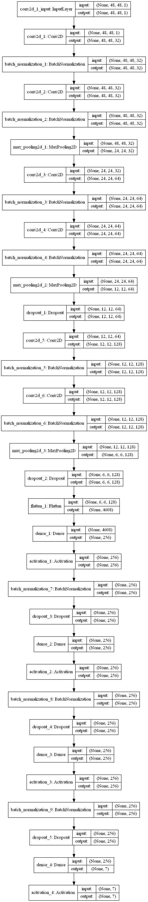

# Pelvis Angle System

这是一个自动识别骨盆关键点并计算角度的带前端的系统
<br>

web应用框架：flask

<br>

前端：HTML+boostrap+js

<br>

关键点识别模型：[YOLO](https://github.com/MIRACLE-Center/YOLO_Universal_Anatomical_Landmark_Detection)

## 目录

- [界面展示](#界面展示)
- [Architecture](#architecture)
- [Setup](#setup)
- [Project Structure](#project-structure)
- [Usage](#usage)
- [References](#references)

# 界面展示


# Setup

There are multiple ways to set this up.

### Clone the repo and install dependencies.<br>

```python
git
clone
https: // github.com / susantabiswas / realtime - facial - emotion - analyzer.git
pip
install - r
requirements.txt
```

### Docker Image

You can pull the docker image for this project and run the code there.<br>
```docker pull susantabiswas/emotion-analyzer:latest```

### Dockerfile

You can build the docker image from the docker file present in the repo.

```docker build -t <name> .```

# Project Structure

```

realtime-facial-emotion-analyzer/
├── Dockerfile
├── LICENSE
├── README.md
├── data
│   ├── Ubuntu-R.ttf
│   ├── emojis
│   │   ├── angry.png
│   │   ├── disgusted.png
│   │   ├── fearful.png
│   │   ├── happy.png
│   │   ├── neutral.png
│   │   ├── sad.png
│   │   └── surprised.png
│   ├── media
│   │   ├── 1.JPG
│   │   ├── 2.JPG
│   │   ├── 3.JPG
│   │   ├── 4.JPG
│   │   └── model_plot.png
│   └── sample
│       ├── 1.jpg
│       └── 2.jpg
├── emotion_analyzer
│   ├── emotion_detector.py
│   ├── emotion_detector_base.py
│   ├── exceptions.py
│   ├── face_detection_dlib.py
│   ├── face_detection_mtcnn.py
│   ├── face_detection_opencv.py
│   ├── face_detector.py
│   ├── logger.py
│   ├── media_utils.py
│   ├── model_utils.py
│   └── validators.py
├── models
│   ├── mmod_human_face_detector.dat
│   ├── opencv_face_detector.pbtxt
│   ├── opencv_face_detector_uint8.pb
│   └── shape_predictor_5_face_landmarks.dat
├── requirements.txt
├── tests
│   ├── conftest.py
│   ├── test_face_detection_dlib.py
│   ├── test_face_detection_mtcnn.py
│   ├── test_face_detection_opencv.py
│   └── test_media_utils.py
├── training
│   ├── data_prep.py
│   ├── facial Emotions.ipynb
│   └── preprocess.py
└── video_main.py
```

# Usage

### Emotion Recognition

Depending on the use case, whether to aim for accuracy and stability or speed etc., you can pick the face detector.
Also, there are customization options inside face detectors to decide the facial ROI.

### To analyze facial emotion using a webcam

```python
# Inside project root
import video_main

# You can pick a face detector depending on Acc/speed requirements
emotion_recognizer = EmotionAnalysisVideo(
    face_detector="dlib",
    model_loc="models",
    face_detection_threshold=0.0,
)
emotion_recognizer.emotion_analysis_video(
    video_path=None,
    detection_interval=1,
    save_output=False,
    preview=True,
    output_path="data/output.mp4",
    resize_scale=0.5,
)
```

### To analyze facial emotion using a video file

```python
# Inside project root
import video_main

# You can pick a face detector depending on Acc/speed requirements
emotion_recognizer = EmotionAnalysisVideo(
    face_detector="dlib",
    model_loc="models",
    face_detection_threshold=0.0,
)
emotion_recognizer.emotion_analysis_video(
    video_path='data/sample/test.mp4',
    detection_interval=1,
    save_output=False,
    preview=True,
    output_path="data/output.mp4",
    resize_scale=0.5,
)
```

### Emotion recognition using an image

```python
# Inside project root
from emotion_analyzer.media_utils import load_image_path
from emotion_analyzer.emotion_detector import EmotionDetector

emotion_detector = EmotionDetector(
    model_loc="models",
    face_detection_threshold=0.8,
    face_detector="dlib",
)
# Load the test image
img = load_image_path("data/sample/1.jpg")
emotion, emotion_conf = emotion_detector.detect_facial_emotion(img)
```

There are 4 face detectors namely dlib (HOG, MMOD), MTCNN, OpenCV (CNN). All the face detectors are based on a common
abstract class and have a common detection interface **detect_faces(image)**.

```python
# import the face detector you want, it follows absolute imports
from emotion_analyzer.media_utils import load_image_path
from emotion_analyzer.face_detection_dlib import FaceDetectorDlib

face_detector = FaceDetectorDlib(model_type="hog")
# Load the image in RGB format
image = load_image_path("data/sample/1.jpg")
# Returns a list of bounding box coordinates
bboxes = face_detector.detect_faces(image)
```

# Architecture

<br>
<br>

# References

The awesome work Davis E. King has done:
http://dlib.net/cnn_face_detector.py.html,
https://github.com/davisking/dlib-models<br>
You can find more about MTCNN from here: https://github.com/ipazc/mtcnn
<br>
Dataset used was from Kaggle fer2013
Challenge [Challenges in Representation Learning: Facial Expression Recognition Challenge](https://www.kaggle.com/c/challenges-in-representation-learning-facial-expression-recognition-challenge/data)
<br>
Emojis used were from https://emojiisland.com/
<br>
Ubuntu font license: https://ubuntu.com/legal/font-licence
