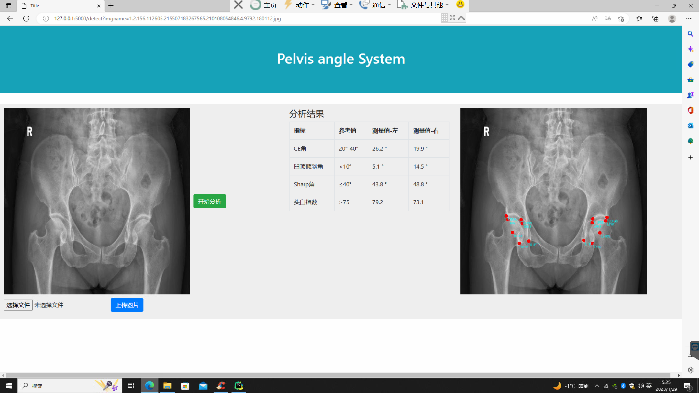
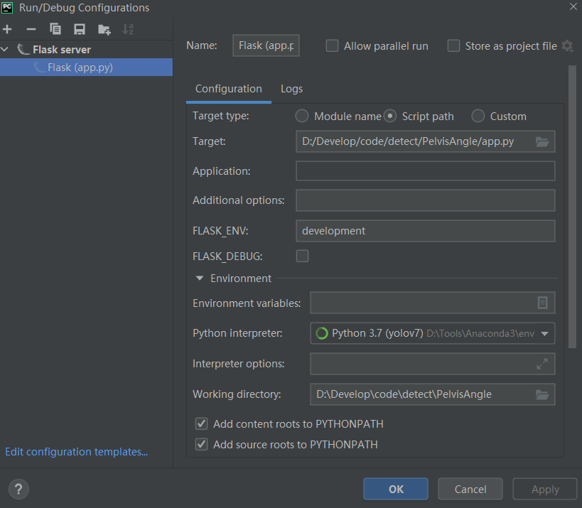

# Pelvis Angle System

这是一个自动识别骨盆关键点并计算角度的带前端的系统
<br>

web应用框架：flask

<br>

前端：HTML+boostrap+js

<br>

关键点识别模型：[YOLO](https://github.com/MIRACLE-Center/YOLO_Universal_Anatomical_Landmark_Detection)

## 目录

- [界面展示](#界面展示)
- [安装](#安装)
- [Project Structure](#project-structure)
- [基本用法](#基本用法)
- [数据集](#数据集)
- [训练](#训练)
- [测试](#测试)
- [References](#references)

## 界面展示



## 安装

**Clone the repo and install dependencies.<br>**

```shell
git clone https://github.com/huangchenxi304/PelvisAngle
pip install - r requirements.txt
```

## Project Structure

```
PelvisAngle
│  app.py
│  README.md
│  requirements.txt
│      
├─static
│  ├─css
│  │      
│  ├─images
│  │      1.2.156.112605.215507183267565.210106021535.4.9624.104022.jpg
│  │      1.2.156.112605.215507183267565.210106021535.4.9624.104022.png
│  │      
│  └─js
│          
├─templates
│      base.html
│      image.html
│      
├─UALD
│  │          
│  ├─data
│  │  ├─gupen
│  │  │  ├─labels
│  │  │  │      1.3.12.2.1107.5.3.58.40252.12.202101010955490437.json
│  │  │  │      1.3.12.2.1107.5.3.58.40252.12.202101011540210171.json
│  │  │  │      ......
│  │  │  │      
│  │  │  └─pngs
│  │  │          1.3.12.2.1107.5.3.58.40252.12.202101010955490437.jpg
│  │  │          1.3.12.2.1107.5.3.58.40252.12.202101011540210171.jpg
│  │  │          ......
│  │          
│  ├─runs
│  │  └─unet2d_runs
│  │  │        config_origin.yaml
│  │  │        config_train.yaml
│  │  │   
│  │  ├─GU2Net_runs
│  │  │  │  config_origin.yaml
│  │  │  │  config_single.yaml
│  │  │  │  config_test.yaml
│  │  │  │  config_train.yaml
│  │  │  │  learning_rate.png
│  │  │  │  loss.png
│  │  │  │  network_graph.txt
│  │  │  │  
│  │  │  ├─checkpoints
│  │  │  │      best_GU2Net_runs_epoch098_train5234.624233_val1716.078491.pt
│  │  │  │      best_GU2Net_runs_epoch098_train73.344884_val17.906089.pt
│  │  │  │      ......
│  │  │  │      train_val_loss.txt
│  │  │  │      
│  │  │  └─results
│  │  │      ├─loss
│  │  │      │      epoch_098_loss_54.583926.txt
│  │  │      │      epoch_099_loss_17.908456.txt
│  │  │      │      ......
│  │  │      │      
│  │  │      ├─single_epoch000
│  │  │      │  └─gupen
│  │  │      │          1.2.156.112605.215507183267565.210112031150.4.9460.116412.jpg_gt-pred.png
│  │  │      │          1.2.156.112605.215507183267565.210112031150.4.9460.116412.jpg_gt.npy
│  │  │      │          1.2.156.112605.215507183267565.210112031150.4.9460.116412.jpg_gt.png
│  │  │      │          1.2.156.112605.215507183267565.210112031150.4.9460.116412.jpg_input.npy
│  │  │      │          
│  │  │      └─train_epoch099
│  │  │          └─gupen
│  │  │                  1.3.46.670589.26.902153.4.20180821.102032.657106.0.jpg_gt-pred.png
│  │  │                  1.3.46.670589.26.902153.4.20180821.102032.657106.0.jpg_gt.npy
│  │  │                  1.3.46.670589.26.902153.4.20180821.102032.657106.0.jpg_gt.png
│  │  │                  1.3.46.670589.26.902153.4.20180821.102032.657106.0.jpg_input.npy               
│  │          
│  └─universal_landmark_detection
│      │  config.yaml
│      │  evaluation.py
│      │  main.py
│      │  
│      ├─.eval
│      │  └─.._runs_GU2Net_runs_results_single_epoch000
│      │      │  distance.yaml
│      │      │  summary.yaml
│      │      │  
│      │      └─gupen
│      │          ├─gt_laels
│      │          │      
│      │          ├─images
│      │          │      1.2.156.112605.215507183267565.210112031150.4.9460.116412.png
│      │          │      1.2.156.112605.215507183267565.210112031150.4.9460.116412.txt
│      │          │      
│      │          └─labels
│      │                  1.2.156.112605.215507183267565.210112031150.4.9460.116412.jpg.txt
│      │                  
│      └─model
│          │  runner.py
│          │  
│          ├─datasets
│          │  │  gupen.py
│          │  │  data_pre_loc.py
│          │  │  __init__.py
│          │          
│          ├─networks
│          │  │  gln.py
│          │  │  gln2.py
│          │  │  globalNet.py
│          │  │  loss_and_optim.py
│          │  │  u2net.py
│          │  │  unet2d.py
│          │          
│          ├─utils             
```

## 基本用法

以flask server运行app.py后，本地浏览器访问http://127.0.0.1:5000



## 数据集

数据集存放目录如下：

```
├─UALD
│  │          
│  ├─data
│  │  ├─gupen
│  │  │  ├─labels
│  │  │  │      1.3.12.2.1107.5.3.58.40252.12.202101010955490437.json
│  │  │  │      1.3.12.2.1107.5.3.58.40252.12.202101011540210171.json
│  │  │  │      ......
│  │  │  │      
│  │  │  └─pngs
│  │  │          1.3.12.2.1107.5.3.58.40252.12.202101010955490437.jpg
│  │  │          1.3.12.2.1107.5.3.58.40252.12.202101011540210171.jpg
│  │  │          ......
```

## 训练

### 1.训练和验证数据集分割（可选）

默认数据集比例训练：验证：测试 = 8：1：1。可根据数据集情况自行确定并修改gupen.py 42、43行代码

gupen.py文件位置为：

```
├─UALD 
│  └─universal_landmark_detection             
│      └─model
│          ├─datasets
│          		└─gupen.py
```

```python
        n = len(files)
        train_num = round(n*0.8)
        val_num = round(n*0.1)
        test_num = n - train_num - val_num
```

### 2.参数设置（必选）

默认为预测单张图片模式【“single”】。训练时应修改main.py中启动参数-p 的默认值为【“train”】

main.py文件位置为：

```
├─UALD                     
│  └─universal_landmark_detection
│      └─main.py
```


```python
parser.add_argument("-p", "--phase", choices=['train', 'validate', 'test', 'single'], default='single') 
# 训练时修改为default='train'
```

### 3.模型选择（可选）

本关键点检测算法提供两种模型：U-Net model和GU2Net model。GU2Net model表现较好。<br>

默认模型为GU2Net model


若需要使用U-Net model，请修改如下2处参数：


4.从0开始或载入权重训练（必选）


5.开始训练


6.训练结果


## 测试


## 验证（生成带有预测点和金标准的结果图）


## References

The awesome work Davis E. King has done:
http://dlib.net/cnn_face_detector.py.html,
